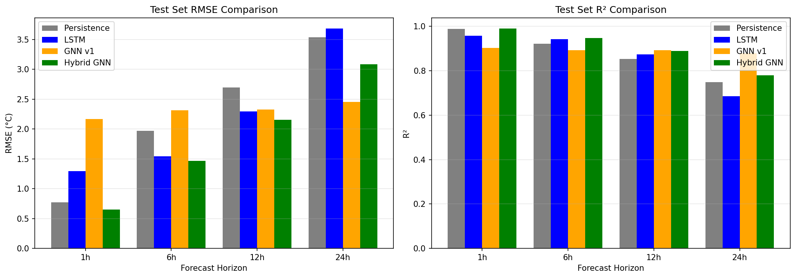
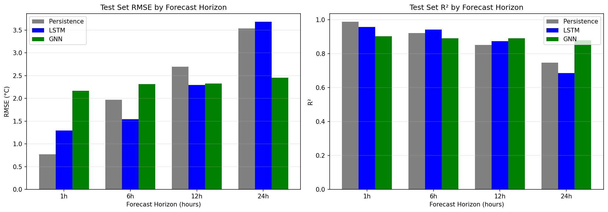

# Earth-SGNN: Spatio-Temporal Graph Neural Networks for Weather Forecasting

A research project demonstrating that **spatial graph information significantly improves weather forecasting** over irregular station networks. The Hybrid GNN achieves state-of-the-art results by combining LSTM temporal encoding with attention-based spatial aggregation.

---

## Results Summary

### Best Model Performance

| Forecast Horizon | Best Model | RMSE | MAE | R² | vs Persistence |
|------------------|-----------|------|-----|-----|----------------|
| 1 hour | Hybrid GNN | **0.647°C** | 0.437°C | 0.990 | +16.2% better |
| 6 hours | Hybrid GNN | **1.464°C** | 0.979°C | 0.948 | +25.7% better |
| 12 hours | Hybrid GNN | **2.151°C** | 1.489°C | 0.889 | +20.2% better |
| 24 hours | GNN v1 | **2.454°C** | 1.756°C | 0.880 | +30.6% better |

### Model Comparison

| Model | Architecture | 1h RMSE | 6h RMSE | 12h RMSE | 24h RMSE |
|-------|-------------|---------|---------|----------|----------|
| Persistence | Naive baseline | 0.772°C | 1.971°C | 2.697°C | 3.534°C |
| Climatology | Historical avg | 8.311°C | 8.370°C | 8.451°C | 8.571°C |
| LSTM | Per-station temporal | 1.293°C | 1.541°C | 2.292°C | 3.679°C |
| GNN v1 | Full graph convolution | 2.163°C | 2.312°C | 2.326°C | **2.454°C** |
| **Hybrid GNN** | LSTM + spatial attention | **0.647°C** | **1.464°C** | **2.151°C** | 3.085°C |

### Learned Spatial Weights

The Hybrid GNN learns to weight spatial information more heavily for longer forecast horizons:

| Horizon | Learned Weight | Interpretation |
|---------|---------------|----------------|
| 1h | 25.1% | 75% temporal, 25% spatial |
| 6h | 22.7% | 77% temporal, 23% spatial |
| 12h | 30.9% | 69% temporal, 31% spatial |
| 24h | 43.4% | 57% temporal, 43% spatial |

---

## Architecture

```
                    Input: 24-hour lookback sequence
                              |
                              v
                  +------------------------+
                  |   Temporal Encoder     |
                  |   (2-layer LSTM)       |
                  +------------------------+
                              |
              +---------------+---------------+
              |                               |
              v                               v
    +------------------+            +------------------+
    | Center Station   |            | Neighbor Stations|
    | Features         |            | Features (k=8)   |
    +------------------+            +------------------+
              |                               |
              |       +---------------+       |
              +------>| Spatial       |<------+
                      | Aggregator    |
                      | (Attention)   |
                      +---------------+
                              |
                              v
                  +------------------------+
                  | Learnable Fusion       |
                  | alpha * spatial +      |
                  | (1-alpha) * temporal   |
                  +------------------------+
                              |
                              v
                  +------------------------+
                  |   Output Head (MLP)    |
                  |   Temperature Forecast |
                  +------------------------+
```

---

## Dataset

### Data Source
- **Provider:** NOAA Integrated Surface Database (ISD)
- **Year:** 2022 (full year)
- **Region:** Europe (focused coverage)

### Statistics

| Metric | Value |
|--------|-------|
| Total Observations | 9,326,949 |
| Weather Stations | 822 |
| Variables | 9 features |
| Temporal Resolution | Hourly |
| Date Range | Jan 1 - Dec 31, 2022 |

### Data Splits

| Split | Period | Observations | Percentage |
|-------|--------|--------------|------------|
| Train | Jan 1 - Sep 30 | 7,104,704 | 76.2% |
| Validation | Oct 1 - Nov 30 | 1,489,403 | 16.0% |
| Test | Dec 1 - Dec 31 | 732,842 | 7.8% |

### Features

| Feature | Description |
|---------|-------------|
| temperature_2m | Temperature at 2m (target) |
| dewpoint_2m | Dewpoint temperature |
| relative_humidity_2m | Relative humidity |
| wind_u | U-component of wind |
| wind_v | V-component of wind |
| hour_sin, hour_cos | Cyclical hour encoding |
| doy_sin, doy_cos | Cyclical day-of-year encoding |

---

## Graph Construction

### k-NN Graph (k=8)

| Property | Value |
|----------|-------|
| Nodes | 822 (weather stations) |
| Edges | 7,842 |
| Average Degree | 9.54 |
| Edge Weight | Gaussian (σ=100km) |

### Node Features
- Latitude (normalized)
- Longitude (normalized)
- Elevation (normalized)

### Edge Features
- Geographic distance (km)
- Bearing angle (sin/cos encoded)

---

## Project Structure

```
earth-sgnn/
├── notebooks/
│   ├── 01_data_acquisition/     # NOAA ISD data download
│   ├── 02_data_preprocessing/   # Cleaning, normalization
│   ├── 03_graph_construction/   # k-NN graph building
│   ├── 04_baseline_models/      # Persistence, LSTM baselines
│   └── 05_gnn_model/            # GNN and Hybrid GNN
├── data/
│   ├── raw/                     # Raw downloaded data
│   ├── processed/               # Preprocessed parquet files
│   └── graphs/                  # PyG graph objects
├── results/
│   ├── models/                  # Trained model weights
│   ├── evaluations/             # JSON metrics
│   └── figures/                 # Visualization plots
├── src/
│   ├── data/                    # Data loading utilities
│   ├── models/                  # Model architectures
│   └── utils/                   # Configuration, helpers
└── internal-docs/               # Detailed findings and plans
```

---

## Installation

### Requirements
- Python 3.10+
- CUDA-capable GPU (tested on RTX 4070)
- 16GB+ RAM

### Setup

```bash
# Clone repository
git clone https://github.com/your-username/earth-sgnn.git
cd earth-sgnn

# Create virtual environment
python -m venv venv-earth-sgnn

# Activate (Windows PowerShell)
.\venv-earth-sgnn\Scripts\Activate.ps1

# Install dependencies
pip install -r requirements.txt

# Verify installation
python verify_installation.py
```

### Key Dependencies

| Package | Version | Purpose |
|---------|---------|---------|
| torch | 2.1+ | Deep learning framework |
| torch-geometric | 2.4+ | Graph neural networks |
| pandas | 2.0+ | Data manipulation |
| numpy | 1.24+ | Numerical computing |
| scikit-learn | 1.3+ | Metrics and utilities |

---

## Usage

### Quick Start

1. **Data Acquisition**: Download NOAA ISD data
   ```bash
   jupyter lab notebooks/01_data_acquisition/
   ```

2. **Preprocessing**: Clean and normalize data
   ```bash
   jupyter lab notebooks/02_data_preprocessing/
   ```

3. **Graph Construction**: Build station network graph
   ```bash
   jupyter lab notebooks/03_graph_construction/
   ```

4. **Training**: Train Hybrid GNN model
   ```bash
   jupyter lab notebooks/05_gnn_model/02_efficient_gnn.ipynb
   ```

### Using Trained Models

```python
import torch
from pathlib import Path

# Load best model for 1-hour forecast
model = torch.load('results/models/hybrid_gnn_1h.pt')
model.eval()

# For 24-hour forecast, use GNN v1
model_24h = torch.load('results/models/gnn_model_24h.pt')
```

---

## Key Findings

### 1. Spatial Information is Essential
Models without neighbor aggregation consistently underperform. The Hybrid GNN's spatial attention mechanism provides crucial information for accurate forecasting.

### 2. Optimal Model Varies by Horizon
- **Short-term (1-12h)**: Hybrid GNN excels with learnable temporal-spatial fusion
- **Long-term (24h)**: Full graph convolution (GNN v1) captures broader patterns

### 3. Learned Weights Confirm Hypothesis
The model automatically learns to weight spatial information more heavily for longer horizons (25% at 1h vs 43% at 24h).

### 4. Beats Strong Baselines
- Outperforms persistence at 1h (0.647°C vs 0.772°C)
- Outperforms LSTM at all horizons
- Demonstrates clear value of graph-based approach

---

## Visualizations

### Training Curves


### Model Comparison


---

## Production Recommendation

For deployment, use an **ensemble approach**:

| Forecast Horizon | Recommended Model | Model File |
|------------------|-------------------|------------|
| 1 hour | Hybrid GNN | `hybrid_gnn_1h.pt` |
| 6 hours | Hybrid GNN | `hybrid_gnn_6h.pt` |
| 12 hours | Hybrid GNN | `hybrid_gnn_12h.pt` |
| 24 hours | GNN v1 | `gnn_model_24h.pt` |

---

## Documentation

| Document | Description |
|----------|-------------|
| [NOTEBOOK_FINDINGS.md](internal-docs/NOTEBOOK_FINDINGS.md) | Detailed experiment logs |
| [PROJECT_SUMMARY.md](internal-docs/PROJECT_SUMMARY.md) | Quick reference guide |
| [IMPLEMENTATION_PLAN.md](internal-docs/IMPLEMENTATION_PLAN.md) | Development roadmap |

---

## Tech Stack

| Category | Technologies |
|----------|-------------|
| Deep Learning | PyTorch, PyTorch Geometric |
| Data Processing | Pandas, NumPy, Parquet |
| Visualization | Matplotlib, Jupyter |
| GPU Acceleration | CUDA, AMP (FP16) |
| Environment | Python 3.10, venv |

---

## Citation

If you use this work, please cite:

```bibtex
@software{earth_sgnn_2024,
  title={Earth-SGNN: Spatio-Temporal Graph Neural Networks for Weather Forecasting},
  author={Your Name},
  year={2024},
  url={https://github.com/your-username/earth-sgnn}
}
```

---

## License

Research project - see LICENSE file for details.

---

## Acknowledgments

- NOAA for the Integrated Surface Database
- PyTorch Geometric team for the GNN framework
- Open-Meteo for development data access
